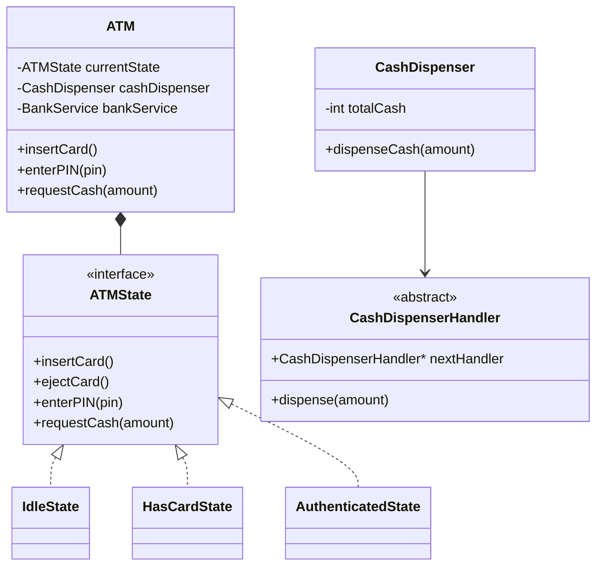

# 1. Problem Statement

Design an **Automated Teller Machine (ATM) System** that enables customers to perform common banking operations without interacting with a human teller. The ATM should interact with physical hardware devices such as the card reader, keypad, and cash dispenser, while also securely communicating with the bank’s backend servers to validate users and process transactions.

The system should support secure, reliable, and concurrent transaction processing while handling hardware and network failures gracefully.

## Primary Actors

- **Customer (User):** Uses the ATM to perform banking operations.
- **Bank System (Backend):** Handles authentication, account validation, and transaction processing.
- **ATM Operator:** Maintains the ATM machine, including cash replenishment and hardware servicing.

---

# 2. Requirements

## Functional Requirements

### 1. User Authentication
Customers must be able to authenticate themselves using:
- A valid ATM/Debit card
- A secure PIN

The ATM should verify credentials through the bank backend before allowing access to banking services.

---

### 2. Balance Inquiry
Authenticated users should be able to:
- View their current account balance
- Retrieve updated account information from the bank server

---

### 3. Cash Withdrawal
Customers should be able to:
- Enter the amount they wish to withdraw
- Receive cash in appropriate denominations

The system must:
- Verify sufficient account balance
- Ensure the ATM has enough cash available
- Dispense the correct combination of notes

---

### 4. Deposit Functionality
The ATM should support:
- Cash deposits
- Check deposits

The deposited amount/check should be securely recorded and forwarded to the bank system for processing.

---

### 5. Error Handling
The system must gracefully handle failures such as:
- Cash dispenser jams
- ATM running out of cash
- Card getting stuck
- Network communication failures
- Transaction timeouts

Users should receive meaningful error messages, and incomplete transactions must be safely rolled back.

---

# 3. Non-Functional & Concurrency Requirements

## Atomicity (ACID Compliance)

ATM transactions must be fully atomic.

This means:
- Either the entire transaction succeeds
- Or the entire transaction fails and rolls back

### Example
If:
1. The bank deducts money from the account
2. But the cash dispenser fails to dispense cash

Then:
- The deduction must be reversed automatically
- The customer should not lose money

This ensures transactional consistency and reliability.

---

## Concurrency Control

The system must safely support multiple ATMs accessing the same account simultaneously.

### Problem Scenario
Two users attempt to withdraw money from the same account at the exact same time using different ATMs.

Without proper synchronization:
- Both transactions may succeed incorrectly
- The account could become overdrawn

### Solution
The backend system should use:
- Database locking
- Transaction isolation
- Concurrency control mechanisms

to prevent race conditions and maintain account consistency.

---

## Security Requirements

Sensitive customer information must always remain secure.

### Data That Must Be Protected
- PIN numbers
- Card information
- Account details
- Transaction records

### Security Measures
- Encrypt PINs before transmission
- Use secure communication channels (TLS/SSL)
- Prevent unauthorized access
- Securely store sensitive information

---

# 4. Core Entities & Class Design

## ATM

The **ATM** class acts as the central controller of the system.

### Responsibilities
- Coordinates all ATM operations
- Manages hardware components
- Maintains current ATM state
- Handles user sessions and transactions

The ATM aggregates all hardware modules and interacts with the bank service layer.

---

## Hardware Abstractions

Hardware components should be represented as separate classes to isolate device-specific behavior.

---

### CardReader

Responsible for:
- Detecting card insertion
- Reading card details
- Ejecting the card
- Handling card-related hardware issues

---

### CashDispenser

Responsible for:
- Managing available cash inventory
- Dispensing correct denominations
- Detecting cash jams or shortages

---

### Keypad

Responsible for:
- Capturing PIN input
- Accepting transaction selections
- Receiving withdrawal/deposit amounts

---

## BankService

`BankService` is an interface (abstract class in C++) that represents communication with the bank backend system.

### Responsibilities
- Authenticate users
- Validate balances
- Process debit/credit transactions
- Maintain transaction records

This abstraction allows the ATM system to remain independent from the actual banking implementation.

---

## Transaction

`Transaction` is an abstract base class representing a banking operation performed by the customer.

Different transaction types extend this class.

### Examples
- `Withdrawal`
- `Deposit`
- `BalanceInquiry`

### Benefits
- Promotes extensibility
- Encapsulates transaction-specific logic
- Simplifies transaction management

---

## ATMState

`ATMState` is an interface used to implement the **State Design Pattern**.

The ATM behaves differently depending on its current state.

### Example States
- `IdleState`
- `CardInsertedState`
- `AuthenticatedState`
- `TransactionState`

### Purpose
This prevents invalid actions from being executed in inappropriate states.

For example:
- Withdrawal should not be allowed before authentication
- PIN entry should not be accepted when no card is inserted

This improves system reliability and maintainability.

---

# 5. UML Class Diagram

