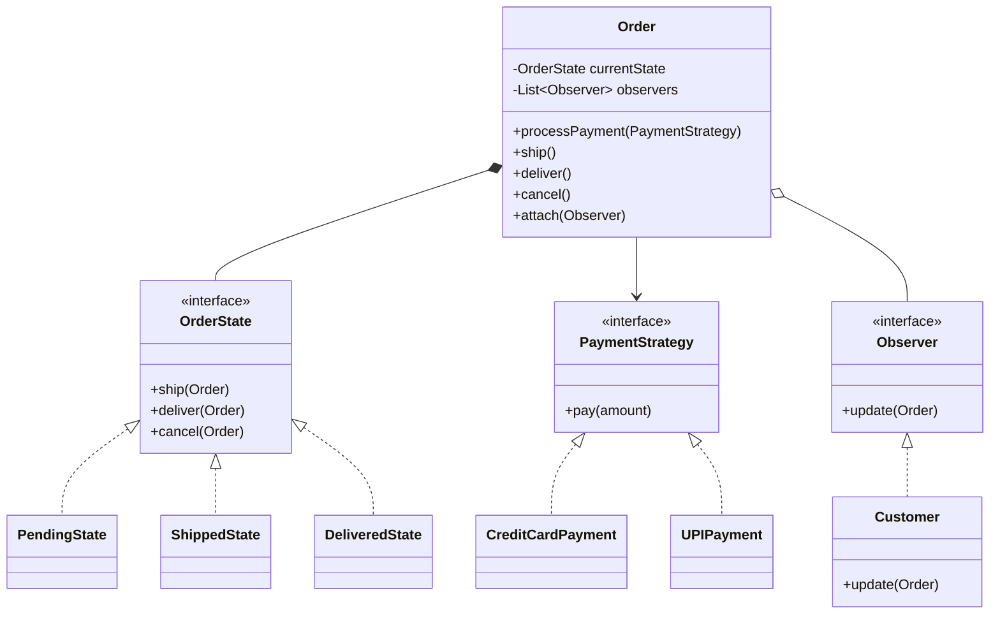

# E-Commerce Platform (Amazon / Flipkart) - Low-Level Design

# 1. Problem Statement

Design the core backend systems for an online e-commerce platform where users can browse products, add them to a shopping cart, securely checkout, and track their orders. The system must handle inventory management, multiple payment gateways, and real-time order status tracking.

The platform should be scalable, extensible, and capable of handling concurrent purchase requests efficiently, especially during high-traffic events such as flash sales.

## Primary Actors

- **Customer (Shopper):** Searches products, places orders, and tracks deliveries.
- **Seller/Admin:** Manages products, pricing, and inventory.
- **System:** Handles payments, inventory updates, order processing, and notifications.

---

# 2. Requirements

## Functional Requirements

### 1. Product Search & Viewing
Customers should be able to:
- Search products
- Browse categories
- View product details such as:
  - Price
  - Description
  - Ratings
  - Availability

---

### 2. Shopping Cart Management
Customers can:
- Add products to cart
- Remove products from cart
- Update product quantities

The cart acts as a temporary session before checkout.

---

### 3. Checkout & Payments
Customers should be able to securely checkout using multiple payment methods:

- Credit/Debit Cards
- UPI
- PayPal

The system should support adding new payment methods easily without modifying existing code.

---

### 4. Order Management
The system should:
- Create orders after successful payment
- Track order lifecycle
- Update order states automatically

### Example Order States
- Placed
- Shipped
- Delivered
- Cancelled

---

### 5. Notifications
Customers should receive notifications whenever:
- Order is placed
- Order is shipped
- Order is delivered
- Order is cancelled

Notifications may be sent via:
- Email
- SMS
- Push Notifications

---

# 3. Non-Functional & Concurrency Requirements

## Concurrency (Inventory Locking)

The system must prevent race conditions during simultaneous purchases.

### Problem Scenario
Two users try to purchase the last remaining unit of a product at the exact same time.

Without proper synchronization:
- Both orders may succeed incorrectly
- Inventory could become negative

### Solution
Use:
- Inventory locking
- Database transactions
- Atomic stock updates

This ensures only one user can successfully reserve the last available unit.

---

## Extensibility

The system should support:
- New payment gateways
- Additional shipping providers
- New notification channels

without modifying existing business logic.

This follows the **Open/Closed Principle**.

---

# 4. Core Entities & Class Design

## ECommerceFacade

The central entry point of the system.

### Responsibilities
- Coordinates subsystems
- Simplifies client interactions
- Handles checkout workflow

The facade hides internal complexity from the client application.

---

## Product

Represents an item available for sale.

### Attributes
- Product ID
- Name
- Price
- Description
- Stock Quantity

---

## InventoryManager

Responsible for:
- Tracking product stock
- Reserving inventory
- Updating stock after purchases/cancellations

### Key Responsibility
Prevent overselling during concurrent purchases.

---

## ShoppingCart

A temporary container holding selected products before checkout.

### Responsibilities
- Add items
- Remove items
- Update quantities
- Calculate total price

---

## Order

Represents a confirmed purchase.

### Responsibilities
- Maintain order state
- Store purchased items
- Process payments
- Notify observers of state changes

The `Order` class acts as the central context for order lifecycle management.

---

## PaymentStrategy

An interface representing payment processing behavior.

### Purpose
Allows runtime selection of payment methods.

### Example Implementations
- `CreditCardPayment`
- `UPIPayment`
- `PayPalPayment`

This design allows easy integration of new payment gateways.

---

## OrderState

Represents the lifecycle state of an order.

### Example States
- `PendingState`
- `ShippedState`
- `DeliveredState`
- `CancelledState`

### Purpose
Ensures only valid state transitions occur.

### Example
- A delivered order cannot be cancelled
- A cancelled order cannot be shipped

---

# 5. UML Class Diagram



---

# 6. Design Patterns Applied

## Strategy Pattern

Used for payment processing.

### Why?
An e-commerce platform supports multiple payment methods.

Instead of writing:

```cpp
if(type == "UPI")
else if(type == "Card")
else if(type == "PayPal")
```

the Strategy Pattern encapsulates each payment method into separate classes.

### Benefits
- Open/Closed Principle
- Easy extensibility
- Cleaner payment logic

---

## State Pattern

Used for managing the order lifecycle.

### Order Flow
```text
Pending -> Shipped -> Delivered
```

The State Pattern ensures:
- Valid transitions only
- Cleaner state-specific behavior
- Better maintainability

### Example
- Delivered orders cannot be cancelled
- Cancelled orders cannot be shipped

---

## Observer Pattern

Used for customer notifications.

### How It Works
Customers subscribe to order updates.

Whenever the order state changes:
- All observers are notified automatically

### Example Notifications
- Email alerts
- Push notifications
- SMS updates

### Benefits
- Loose coupling
- Real-time updates
- Easy addition of new notification systems
