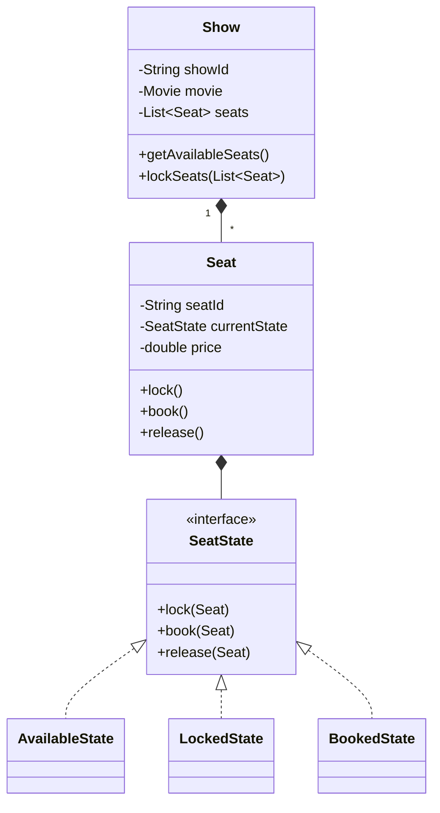

# BookMyShow (Movie Ticket Booking) - Low-Level Design

# 1. Problem Statement

Design an online movie ticket booking system similar to **BookMyShow** or **Fandango** that allows users to browse movies, select a city, choose theaters and show timings, and book specific seats.

The platform must handle high traffic efficiently, especially during blockbuster releases where thousands of users may attempt to reserve the same seats simultaneously.

The system should ensure:
- High availability
- Concurrency safety
- Consistent seat allocation
- Reliable payment and booking workflows

## Primary Actors

- **Customer (User):** Searches movies, selects seats, and books tickets.
- **System:** Handles booking workflow, concurrency control, seat locking, and payments.
- **Cinema Admin:** Manages movies, screens, theaters, and show schedules.

---

# 2. Requirements

## Functional Requirements

### 1. Movie Search
Users should be able to search movies using:
- City
- Genre
- Language
- Movie name

The platform should display currently running and upcoming movies.

---

### 2. Theater & Showtime Selection
Users should be able to:
- View theaters showing a specific movie
- Browse available show timings
- Select a preferred show

Each show represents a movie playing on a specific screen at a particular time.

---

### 3. Seat Selection
Users should be able to:
- View a visual seating layout
- Select available seats
- See seat categories and pricing

The system should clearly distinguish:
- Available seats
- Locked seats
- Booked seats

---

### 4. Booking & Payment
Users should be able to:
- Proceed to checkout
- Make payment securely
- Confirm seat booking

Supported payment methods may include:
- Credit/Debit Cards
- UPI
- Wallets
- Net Banking

---

### 5. Booking Confirmation
After successful payment:
- A booking confirmation should be generated
- Tickets should be sent to the user via:
  - Email
  - SMS
  - App notifications

---

# 3. Non-Functional & Concurrency Requirements

## Concurrency (Seat Locking)

This is the most critical requirement in the system.

### Problem Scenario
Two users attempt to reserve the same seat simultaneously during a high-demand movie release.

Without proper concurrency handling:
- Both users may complete payment
- The same seat could be sold twice

This must never happen.

---

## Seat Locking Mechanism

When a user selects seats:
- Those seats should be temporarily marked as **Locked**
- The lock duration is typically **5 minutes**

During this period:
- Other users cannot reserve those seats
- The original user must complete payment before the timer expires

### Lock Workflow
```text
Available -> Locked -> Booked
```

If payment succeeds:
- Seat becomes permanently booked

If payment fails or timeout occurs:
- Seat returns to Available state

---

## Consistency

The system must guarantee:
- No double booking
- Accurate seat availability
- Reliable booking confirmations

Even under heavy traffic conditions.

---

## Atomicity

Seat booking and payment processing must behave atomically.

### Example
If:
1. Payment succeeds
2. But seat booking fails

Then:
- Payment must be rolled back/refunded

Similarly:

If:
1. Seats are locked
2. Payment is not completed within 5 minutes

Then:
- Locks must expire automatically
- Seats become available again

This ensures consistency and reliability.

---

# 4. Core Entities & Class Design

## Movie

Represents a film available for booking.

### Attributes
- Movie ID
- Name
- Genre
- Language
- Duration
- Rating

---

## Cinema

Represents a physical theater location.

### Responsibilities
- Maintain screens
- Manage show schedules
- Organize seat layouts

---

## Screen

Represents a physical auditorium inside a cinema.

### Responsibilities
- Hold seat arrangement
- Host multiple shows

Each screen can run different shows at different times.

---

## Show

Represents a movie screening.

A show is defined by:
- Movie
- Screen
- Start time
- End time
- Seat availability

### Responsibilities
- Display available seats
- Lock seats
- Coordinate booking process

---

## Seat

The most critical entity in the system.

Represents a physical chair inside a screen.

### Attributes
- Seat ID
- Price
- Current state

### Responsibilities
- Locking
- Booking
- Releasing expired locks

The seat maintains its own lifecycle state.

---

## Booking

Represents a confirmed or pending transaction.

### Responsibilities
- Store booked seats
- Maintain payment status
- Generate ticket confirmation
- Track booking details

---

## SeatState

An interface representing the lifecycle state of a seat.

### Example States
- `AvailableState`
- `LockedState`
- `BookedState`

### Purpose
Prevents invalid seat operations.

### Example
- A booked seat cannot be booked again
- A locked seat cannot be reserved by another user

This avoids complex conditional logic and improves maintainability.

---

# 5. UML Class Diagram



---

# 6. Design Patterns Applied

## State Pattern

Used for managing seat lifecycle transitions.

### Seat Lifecycle
```text
Available -> Locked -> Booked
```

The State Pattern ensures:
- Valid state transitions only
- Cleaner seat management logic
- Prevention of invalid booking actions

### Example
- A booked seat cannot be locked again
- A locked seat cannot be booked by another user

This avoids deeply nested conditional statements.

---

## Strategy Pattern (Conceptualized)

Used for dynamic pricing calculations.

### Why?
Ticket pricing varies depending on:
- Seat category
- Weekday/weekend
- Morning/evening shows
- Blockbuster demand

A `PricingStrategy` interface allows different pricing algorithms to be plugged in dynamically.

### Benefits
- Flexible pricing logic
- Easy addition of new pricing rules
- Better maintainability

---

## Observer Pattern (Conceptualized)

Used for booking notifications.

### How It Works
Once a booking is confirmed:
- The `Booking` entity notifies subscribed services

### Example Observers
- `EmailService`
- `SMSService`
- `PushNotificationService`

These services automatically send:
- Tickets
- Booking confirmations
- Status updates

### Benefits
- Loose coupling
- Real-time notifications
- Easy extension for new notification channels
